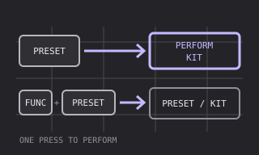
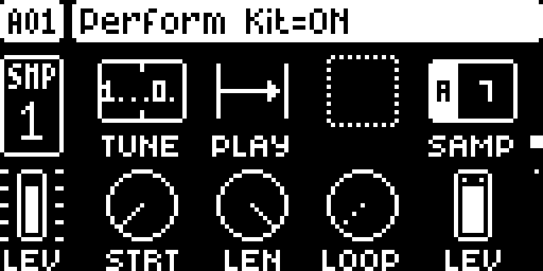
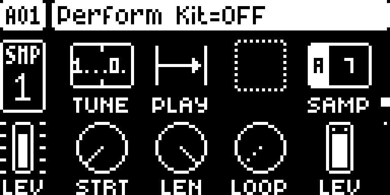
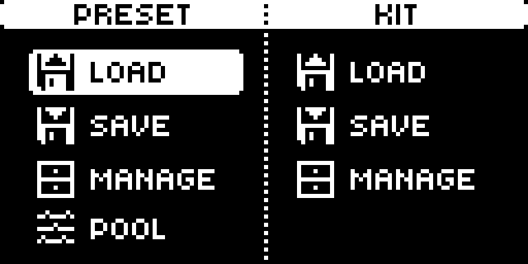

# Perform Direct — Digitakt II

Source draft `1.0.0-experimental`, native upstream version `1.0`, for Digitakt II OS 1.17 and core-dt2 1.0. Imported from [toonst’s elekloader PR #38](https://github.com/irpina/elekloader/pull/38) at `71a5156781838fb5ef1c3e963b3949b781043a0d`. It stays outside the public catalog and native discovery until qualification and owner review.

## Overview

Reach Perform Kit with a single PRESET press while playing live. The mod swaps the two stock PRESET combinations: PRESET alone toggles Perform Kit, and FUNC + PRESET opens the PRESET/KIT menu. It does not add synthesis, parameters, a machine chooser entry or a PERSONALIZE enable row.

## Controls

| Button | With Perform Direct | Stock behavior |
| --- | --- | --- |
| PRESET | Toggle Perform Kit | Open PRESET/KIT menu |
| FUNC + PRESET | Open PRESET/KIT menu | Toggle Perform Kit |

There are no parameter ranges or defaults. The remapping is always active in a build containing this mod. Other buttons and encoders pass through unchanged. Press/repeat/release events for PRESET all carry the swapped modifier bit. The upstream README mentions an earlier hardware build with a PERSONALIZE row; that row is absent from this exact source version.

## Usage

### Tutorial: one-button Perform Kit

1. Start an OS 1.17 build containing core-dt2 1.0 and Perform Direct. Select a kit normally and keep transport stopped while learning the new buttons.
2. Press PRESET without FUNC to toggle Perform Kit. Press PRESET again to return; the stock firmware handles both actions.
3. Hold FUNC, press and release PRESET, then release FUNC to open the PRESET/KIT menu. Close with NO. To remove the remapping entirely, use a future qualified build without this mod or restore your original OS.

The module requires no menu activation. Its selection is a build-time choice. A kit’s normal Perform Kit behavior still depends on the stock OS and your project; the mod changes access only.

## Compatibility and limitations

Digitakt II OS 1.17 only, with its own core-dt2 1.0. It is not a Digitakt mk1 or Digitone port. The key handler uses DDR `.run`, not SRAM `.fast`, so it is callable before the first tick. It subscribes to `ev_key` at order 10, flips bit 1 (`0x02`) in the flags at event offset 16 when the key at offset 12 is PRESET (7), and returns zero so the stock dispatcher continues. Another mod intercepting PRESET or FUNC can conflict and needs combination review. No on-device bypass is present. No DSP code or audio-render hooks are introduced.

## Tests and measurements

[TESTING.md](TESTING.md) separates upstream functional reports, actual capture provenance and pending qualification. The exact capture build allocates 28 bytes to the handler and 576 bytes of combined DDR including core/tables/BSS, with no fast SRAM. No timing/utilization or stress results are invented. Publication requires worst-case cycle counts, exact allocated memory, a passed hardware stress-project report and browser/native byte parity/rejection evidence for this source/build. `qualification.pending.json` records the missing gates explicitly. Ordinary application checks do not run firmware, DSP, emulator or hardware tests.

## Authorship and licences

Digitakt II port and Perform Direct by toonst; source copyright irpina and contributors, GPL-2.0-or-later, preserved in [LICENSE](LICENSE) and `src/perform.c`. The original Modwerk vector thumbnail is GPL-3.0-or-later. Recipes change only source paths; core stock guards are converted to hashes. [Import identities](../../imports/elekloader-pr38-digitakt-ii.json) pin both originals and adapted files. Review does not establish legal clearance for Elektron’s UI or firmware.

## Screens and audio

Actual monochrome framebuffer captures and their sanitized version/source/build/setup records belong in `media/`. The vector above is an illustration, never LCD evidence. No audio is provided: this mod changes two key combinations and adds no audio processing. Captures must show Perform Kit access and the PRESET/KIT menu from the exact pinned build. See [capture provenance](media/capture.json) for the current outcome.

