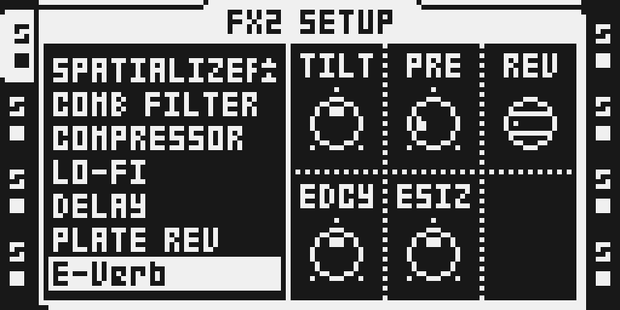
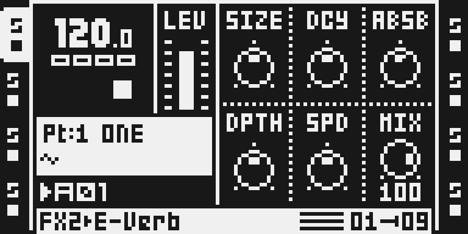
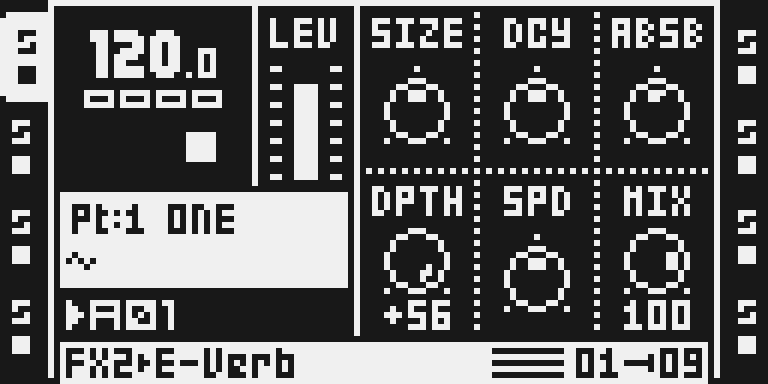
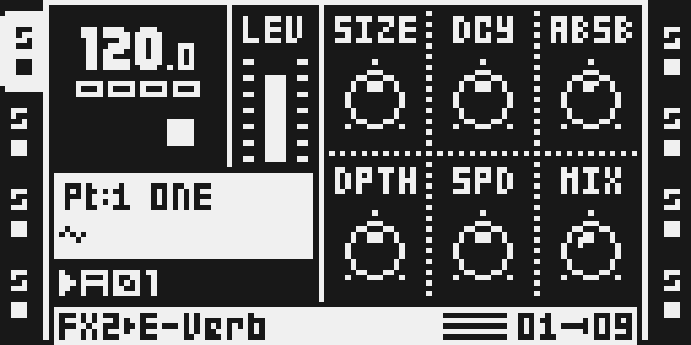
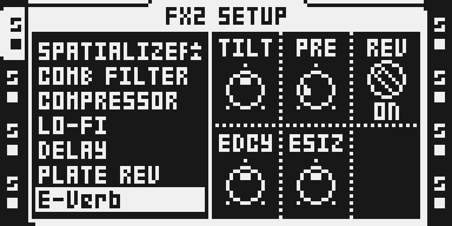

# E-Verb

Version: 0.1.0-experimental · author: [@user1303836](https://github.com/user1303836)

A modulated feedback delay network reverb for the Octatrack's FX2 slot, modelled after Tom Erbe's
Erbe-Verb: a space you can shrink to a two-millisecond box or stretch to a hall, decay past 100 % into a
saturating drone, absorb or diffuse, swirl with a chorus, smear with random grains or lift with octave
shimmer, reverse, and tilt dark or bright. Original code, written from Erbe's published paper.

**Status: experimental release** (`sdk/octabam/modules/everb/`). The owner reports a positive
functional audition on MKII using the exact private EVRB01T01 build. See
[evidence/owner-hardware.md](evidence/owner-hardware.md) for actual statements and coverage limits.
The source, emulator gates, performance record, sound audit and real LCD captures are unchanged.

## Overview

The track's left and right inputs are summed and decimated to 22.05 kHz by an elliptic halfband filter.
They pass a pre-delay (7 to 250 ms), which can also play backwards, and enter a four-line feedback delay
network. Each line runs an allpass for diffusion, a modulated delay, an absorbing low-pass, the decay gain
with a soft cubic saturation, and a 4×4 Hadamard matrix that feeds every line back into the others. Two
stereo taps mix the line outputs with the allpass outputs (the early reflections). The wet signal is
tilted, interpolated back to 44.1 kHz and mixed with the untouched dry signal at equal power.

The modulation follows the paper's three kinds:

- **Cyclic**, left of centre on DPTH: a quadrature oscillator moves the four line lengths in four phases,
  a chorus or doppler swirl.
- **Ergodic**, right of centre: each line reads through two heads at random positions and crossfades
  between them grain by grain, a smeared, drifting tail.
- **Shimmer**, the last sixteen steps of DPTH: a growing share of the grains on two lines glide up an
  octave, so the tail climbs.

Envelope routings take the place of the hardware's CV inputs inside the effect. EDCY and ESIZ send the
reverb's own level into DCY and SIZE, the self-patch a modular player makes with an envelope follower. The
Octatrack's own LFOs, parameter locks, scenes and MIDI CC reach the six main-page knobs like any stock
effect's: the space (SIZE, DCY, ABSB), the modulation (DPTH, SPD) and MIX.

The dry signal is never processed: MIX 0 is the input sample for sample. The wet path adds about 1 ms
beyond the pre-delay. Its bandwidth is that of the 22.05 kHz tank, about 10 kHz: the input decimator
keeps 31 dB of rejection from 14 kHz up (content above it folds into the tank at least 31 dB down), and
the output interpolator 39 dB from 13 kHz. Its wet level was set against the stock reverbs: fully wet,
the Hall starting point below gives the same level over the first second after a hit as DARK REV and
SPRING REV at their defaults (−33.5 dBFS RMS); the shorter default room sits about 5 dB lower.

## Controls

Main page (FX2), all lockable, LFO, scene and MIDI CC destinations:

| Knob | Default | Range | What it does |
|---|---|---|---|
| A SIZE | 64 | 0–127 | Scales every delay over six octaves: the longest line runs 2.2 ms at 0, 18 ms at 64 and 143 ms at 127, and the diffusing allpasses scale with it. Moving it glides every line (a pitch bend, as on the hardware), smoothed so the glide has no block-rate steps. |
| B DCY | 64 | 0–127 | Reflection gain from 0 to 120 %. Up to about 106 the tail decays, from a short room at 40 to minutes at 100 with large sizes; from about 106 it sustains, and the in-loop saturation holds the level. |
| C ABSB | 60 | 0–127 | Below 38 it adds diffusion (allpass gain up to 0.8, an airy wash). Above 38 it adds damping inside the loop: the tail gets darker and shorter. |
| D DPTH | 64 (0) | −64..+63 | Modulation. 0 is none. Left: cyclic chorus/doppler, depth growing with the square of the turn. Right: ergodic grains up to +47; from +48 a growing share of the grains glides up an octave (shimmer), half of them at about +56. |
| E SPD | 64 | 0–127 | Modulation speed, 0.5 Hz at 0 to 256 Hz at 127 (about 12 Hz at 64): the cyclic rate, or how often a grain starts. In the shimmer zone a grain lasts a fixed share of the line length instead, so SIZE sets its pace. |
| F MIX | 51 | 0–127 | Equal-power dry/wet. 0 is exactly the dry input; 127 is all reverb. |

SETUP page (FUNC + FX2), set per Part like a stock effect's SETUP page:

| Knob | Default | Range | What it does |
|---|---|---|---|
| A TILT | 64 (0) | −64..+63 | Wet tone around the mids. Left warms: lows below 250 Hz up to +12 dB, highs down (about −14 dB at 9 kHz at the end). Right brightens: highs above 2 kHz up to +24 dB at 9 kHz; the lows dip only 3 to 5 dB, as the first-order high shelf rises from far below 2 kHz. 0 is flat. |
| B PRE | 25 | 0–127 | Pre-delay, 7 ms at 0, 42 ms at 64, 250 ms at 127 (about 14 ms at 25). With REV on, it is the reverse window (at least 42 ms). |
| C REV | OFF | OFF/ON | Plays the pre-delay buffer backwards in crossfaded windows: swells instead of attacks. A change ducks the pre-delay output, switches while it is silent and reopens, so it does not click. |
| D EDCY | 64 (0) | −64..+63 | The reverb's envelope into DCY. Left reins the tail in as it gets loud (a gated or self-limiting room); right lets loud passages ring longer, up to the decay of DCY 95, but never into sustain: only DCY itself goes there, so from DCY 96 up turning EDCY right changes nothing. 0 is off. |
| E ESIZ | 64 (0) | −64..+63 | The reverb's envelope into SIZE. Left shrinks the space as it gets loud; right grows it, bending the pitch of the tail with the dynamics. 0 is off. |

The sixth SETUP slot (F) is unused and shows no knob.

## Usage

E-Verb lives on FX2 of an audio track. Choose it in FX2 SETUP (hold FUNC, press FX2), at the end of the
effect list. Turn MIX (encoder F on the main page) to taste; it is the only knob that changes the dry
signal's level.

Starting points:

- **Room**: the defaults with MIX at 60–80.
- **Hall**: SIZE 110, DCY 90, ABSB 45, MIX 70.
- **Shimmer pad**: SIZE 100, DCY 100, ABSB 70, DPTH +56 (120), MIX 100.
- **Reverse swells**: REV ON and PRE 90 on the SETUP page, DCY 70, MIX 90.
- **Freeze-like drone**: DCY 110–120 holds the tail; lock DCY back down on a step to release it.
- **Ducked ambience**: EDCY −40 on the SETUP page with a long DCY; the tail opens up in the gaps.

The Octatrack's own modulation takes the place of the hardware's CV patching. An LFO on SIZE gives slow
space-warping; a triangle on DPTH sweeps from chorus into grains; an LFO or locks on SPD change how fast
it swirls; scenes or the crossfader morph between a dry room and a drone; DCY locked to 127 on a step
holds the chord for that step.

### Quick tutorial

1. Select an audio track, hold FUNC and press FX2, turn LEVEL to E-Verb at the end of the list and press YES.
2. Press FX2 to open the main page, turn encoder F (MIX) to 100 and play a sample: the reverb follows each hit. Turn encoder D (DPTH) to +56 for grains with a rising octave shimmer.
3. Turn MIX back to 0 to hear the exact dry signal, or set FX2 back to DELAY or NONE in FX2 SETUP to remove the effect.

## Compatibility and limitations

- **Octatrack MKI and MKII, OS 1.40C**, FX2 of any audio track, all eight tracks (four instances per DSP
  core). FX2 only: the effect needs the 16K-word delay buffer that the OS gives FX2 instances. Effect ID
  0x1b (27).
- **Hardware report:** the owner reports a positive MKII functional audition on EVRB01T01.
  Detailed coverage and unreported tests remain explicit in [the hardware report](evidence/owner-hardware.md).
  MKI, full-load chip timing and broader hardware acceptance are not established.
- **What a build with E-Verb gives up.** The site builds stock DSP code in, so a module's code takes the
  space of stock effects listed on neither menu. E-Verb's 1,588 words take the space of two of the
  FX2-only stock reverbs. On its own it gives up **SPRING REV and DARK REV**: they are missing from the FX2
  chooser, and a saved project that uses either on FX2 plays that slot dry, as NONE. PLATE REV, DELAY and
  every other stock effect stay. Other modules in the same build can change which reverbs are given up;
  the configurator shows the result. This is the builder's ordinary rule for every module with DSP code,
  not a change E-Verb makes to a stock flow.
- **On a build without E-Verb**, a project saved with it plays that FX2 slot dry: effect ID 0x1b
  dispatches to the stock null stub, as NONE does, and the knob values stay in the project. What the
  panel shows for that slot is not tested.
- **No change to any stock flow.** E-Verb adds one chooser row and its own pages. Menus, gestures,
  saving and loading, Parts, scenes, recording, MIDI and timing are untouched. It takes over no MIDI
  message and adds no ColdFire code.
- **The SETUP page is not lockable.** The Octatrack stores parameter locks (and LFO, scene and MIDI CC
  targets) for the six main-page knobs of each FX slot only, so TILT, PRE, REV, EDCY and ESIZ are set per
  Part, as on every stock effect's SETUP page. Which six are on the main page was the author's choice:
  the space, the modulation pair and MIX. The SETUP knobs still glide without zipper noise when turned.
  Scenes on the SETUP page are not tested.
- **Analog BD** refuses every module with an effect ID, E-Verb included.
- **Cost.** E-Verb is dearer than any stock effect. In the stock benchmark's own method it peaks at 376
  executed instructions per sample without trig splits, against 258 for SPRING REV (the cost target for
  new FX) and 293 for DJ EQ, the dearest stock effect. With trig splits at every position, for E-Verb and
  for stock alike, the figures are 382, 314 and 331. The full-call software bound for four per core is
  47,680 of 49,920 modeled cycles per 16-frame block, including trigger splits; see the
  [release bounds](evidence/release-bounds.md). Whether four E-Verbs beside four heavy FX1 effects on one core keep up
  on a real unit is not measured; a core that overruns stops the sequencer on step 1 (see octabam's
  FAILURE_MODES.md).
- **Loud sustained tones.** A full-scale steady sine on a room resonance can push the wet plus dry over
  full scale at high MIX, where the DSP's store limiter clips it; DARK REV and SPRING REV clip more often
  on the same test. The wet itself is hard-limited at the tank rate before the interpolator, so TILT far
  right or a sustaining DCY can clip the wet, with tank-rate aliasing, even at moderate MIX. Turn the
  track's AMP VOL, TILT or MIX down. DCY above about 106 sustains and saturates by design.
- **Shimmer handover.** When DPTH leaves the shimmer zone for the cyclic side, a head that was gliding
  stays on a floor about a tick behind its line's write until its line latches again, which can take a
  grain-clock cycle (about 2 s at SPD 0); meanwhile the wet is 1.5 to 2.5 dB quieter and a little
  brighter. The floor keeps every read inside its own line, and no new gliding grain starts until the
  cyclic depth has glided back to zero.
- **After the tail.** When the input stops, the output settles to a constant offset rather than to
  zero: 6 LSB (−123 dBFS) at the defaults, up to 71 LSB (−101 dBFS) with TILT at an end. It is the
  truncation fixed point of a fixed-point feedback network, not a tone, and far below the converters'
  noise.
- **No tempo sync.** As on the hardware and in the stock reverbs, the modulation runs free (SPD in Hz)
  and the pre-delay is in milliseconds; neither follows the tempo.
- **Saved projects** store the knob values in their slots. A later version that moves a knob says so here.

## Tests and measurements

[TESTING.md](TESTING.md) has every command and result. In short:

- **Render gates** (`python3 modules/everb/verify.py` from the native SDK, all 26
  passing): the source and init rules; static cycles; placement in a real native image; exact dry at MIX
  0 with knobs moving and trig splits; the pre-delay, decay and stereo laws; settling after the input
  stops. Also eight instances isolated under `dsp_host -guard 0x4000 -guard-shared -dirty`, garbage
  start, no zipper on any continuous knob, trig splits, REV switching without clicks, DPTH locked between
  shimmer and chorus every 70 ms, and EDCY unable to hold a loud tail.
- **Performance** ([evidence/performance.json](evidence/performance.json)): 468 cycles/sample static per
  instance; 381.7 instructions/sample measured at the dearest settings with trig splits, against the
  stock effects run through the same cases. The stress run was 32 s with eight instances behind DJ EQ on
  every FX1, three LFOs and 16 slots changing every step on every track, and trig splits: no clobber, no
  hang.
- **Sound** (`npm run fx:audit`): every −12 dBFS tone is clean at the defaults; the tables, the loud-tone
  limits and the same audit of the stock reverbs are in TESTING.md.
- **Hardware**: owner-reported MKII functional audition; see the exact-build report and its limits.

## Authorship and licences

Written by [@user1303836](https://github.com/user1303836), under the MIT licence
([LICENSE](LICENSE)); the LCD captures are under [media/LICENSE.md](media/LICENSE.md). The design follows
Tom Erbe, "Building the Erbe-Verb: Extending the Feedback Delay Network Reverb for Modular Synthesizer
Use", ICMC 2015, published under Creative Commons Attribution 3.0. No code, constants or tables come from
any other reverb. `generate.py` writes `everb.asm` from the design constants; the gate checks that they
match.

E-Verb is not affiliated with or endorsed by Make Noise or Tom Erbe. Erbe-Verb is a Make Noise product,
named here only to say what this effect was modelled after. It is built by octabam's builder (MIT, Sam
Banks). Octatrack is a trademark of Elektron Music Machines; no Elektron firmware is included.

## Screens and audio

Captured from the real 128×64 LCD in the headless ColdFire emulator, running a private build that carries
E-Verb ([media/capture.json](media/capture.json) has the panel sequence and hashes). Emulator captures show
the interface only, not sound or hardware behaviour.

More screenshots:  

**Audio preview.** [Listen](media/audio-preview.mp3). One chord stab, played three times: dry, then the Hall starting point (SIZE 110, DCY 90, ABSB 45, MIX 70), then the Shimmer pad starting point (SIZE 100, DCY 100, ABSB 70, DPTH +56, MIX 100). It is an offline render on a computer through the module's own code, not a recording of an Octatrack. The sample, settings and method are in [audio-preview.json](media/audio-preview.json); rights are in [media rights](media/LICENSE.md).
