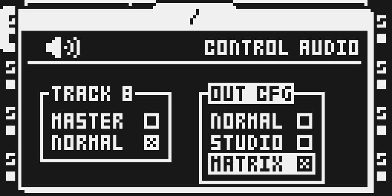
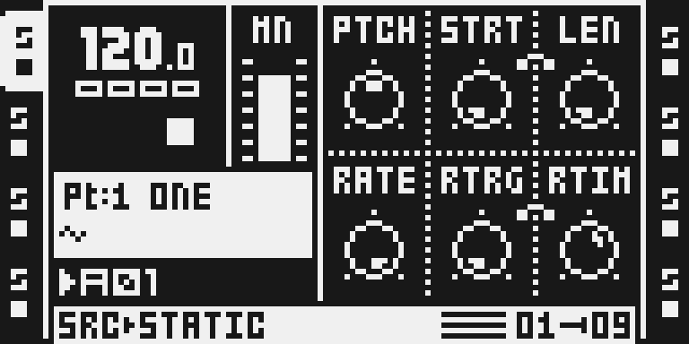
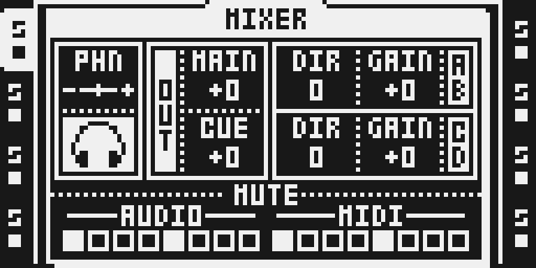

# Output Matrix

Version: 0.1.0-experimental · author: @npp1993

## Overview

Output Matrix turns the Octatrack's headphone jack into a third assignable stereo output, beside MAIN and CUE.

It adds a third choice, MATRIX, to the box stock calls CUE CFG in PROJECT > CONTROL > AUDIO, beside NORMAL and STUDIO; with the module the box is titled OUT CFG. In MATRIX:

- LEVEL sets the track's level, the same for every output it plays on.
- CUE + LEVEL chooses where the track plays, stepped as stock steps a select with few choices, such as THRU's INAB: about three detents per choice when turned briskly, more when turned slowly. The choices are MAIN, CUE and PHONES as stereo pairs in any combination, or a single mono jack: MAIN L, MAIN R, CUE L, CUE R, PHONES L or PHONES R.
- A mono destination sums the track's left and right at half each. A centred sound keeps the level it has on each side in stereo, which is how AMP BAL treats its centre. The sum never clips.
- The MIXER's MIX knob becomes the PHONES output level, alongside MAIN and CUE.
- Inputs A/B and C/D keep stock DIR routing to MAIN.

## Controls

The module has no effect slot and no knob of its own.

| Where | Control | In MATRIX |
| --- | --- | --- |
| PROJECT > CONTROL > AUDIO | OUT CFG (stock: CUE CFG) | NORMAL, STUDIO or MATRIX |
| Any audio track | LEVEL | The track's level, the same on every output it plays on |
| Any audio track | CUE + LEVEL | The track's outputs, shown in the LEV box |
| MIXER | MIX | The PHONES output level |

Destinations, in the order CUE + LEVEL steps through them: MN, CUE, PHN, M+C, M+P, C+P, ALL, MNL, MNR, CUL, CUR, PHL, PHR, OFF.

## Usage

1. Press PROJ and open CONTROL > AUDIO.
2. Move right to OUT CFG, select MATRIX and press YES.
3. Select a track, hold CUE and turn LEVEL to choose its outputs.

To return to stock behaviour, choose NORMAL or STUDIO again.

## Quick tutorial

1. Press PROJ, open CONTROL > AUDIO, move right into OUT CFG, select MATRIX and press YES.
2. Select track 1, hold CUE and turn LEVEL until the LEV box reads PHN: track 1 now plays only in the headphones.
3. Open the MIXER and turn MIX (PHN) to set the headphone level; choose NORMAL again to return to stock routing.

## Compatibility and limitations

**Where the routing is stored**
- Each track's destination is kept in that track's cue-level byte of the Part. It follows the Part and survives Part save, Part reload, project save, the SRC page reset and track clears.
- The choice is saved in the project as CUE_STUDIO_MODE=2.
- **Switching to or from MATRIX converts every Part's LEVEL and cue bytes** (all 16 banks, working and saved Parts, and what plays now). Each mode keeps what the other can express, no level is lost, and a round trip comes back as it was wherever the other mode can hold it. MATRIX has one level per track (L); STUDIO has LEVEL (MAIN) and a cue level; NORMAL has LEVEL, a cue level and one cue setting per track for the whole project (CUE + TRACK).
  - **Leaving MATRIX** (to STUDIO or NORMAL):

    | Destination | LEVEL | Cue level |
    | --- | --- | --- |
    | MN, MNL, MNR, M+P | L | 0 |
    | CUE, CUL, CUR, C+P | 0 | L |
    | M+C, ALL | L | L |
    | PHN, PHL, PHR | L (neither mode has a PHONES-only output, so the track stays audible on MAIN) | 0 |
    | OFF | 0 | 0 |

    Into NORMAL, the tracks whose destination in the current Part includes CUE are also cued. NORMAL has one set of cue settings for the whole project, so other Parts keep their levels but not their own cueing. With CUE MUTES TRACK on (PROJECT > SYSTEM > PERSONALIZE), stock takes every cued track off MAIN, so M+C and ALL play on CUE only in NORMAL, and come back to MATRIX as CUE. The tracks a switch into NORMAL cues send CC 51 out, as CUE + TRACK does.
  - **Entering MATRIX from STUDIO:** LEVEL and a cue level → M+C at LEVEL (the CUE side takes LEVEL); LEVEL only → MAIN; cue level only → CUE at the cue level; neither → MAIN at 0.
  - **Entering MATRIX from NORMAL:** not cued → MAIN; cued with a cue level → M+C at LEVEL, or CUE at the cue level when LEVEL is 0 or CUE MUTES TRACK is on; cued at cue level 0 → MAIN, or OFF (LEVEL kept) when CUE MUTES TRACK leaves it silent.
  - **Track 8 as the master** (MASTER TRACK on) has no cue in NORMAL or STUDIO, as stock: leaving MATRIX it keeps its level on MAIN (0 for OFF) with cue level 0 and is never cued; entering MATRIX it becomes MAIN at its level.
  - **What a round trip loses:** through STUDIO, the mono jacks come back as their stereo pair, PHONES-only as MAIN, C+P as CUE, ALL as M+C and OFF as MAIN at 0. Through NORMAL, also: in Parts other than the current one, a CUE-only track comes back as MAIN at 0 unless the current Part cues the same track.

  Save the project to keep the conversion, as with any edit.
- Before flashing a stock OS, set OUT CFG to NORMAL or STUDIO and save the project. A stock OS treats MATRIX in its power-cycle memory as damage, and at the first power-up it would drop the current bank's unsaved changes.
- On a stock OS, a MATRIX project loads as STUDIO. Its cue levels are then the stored destination codes, 0 to 13, which are very quiet; switch to STUDIO on the module first, so they are converted, before opening the project on a stock OS. Measured in the emulator: stock 1.40C stores 1 where this module stores 2.

**Master track**
- With MASTER TRACK on, tracks routed to MAIN feed the master.
- Track 8's destination picks which jacks the master plays from.
- Tracks routed to CUE or PHONES bypass the master.

**Status**
- Built and tested in the emulator, and on an MKII (see Tests and measurements): the CUE CFG row, the project load, the CUE + LEVEL destination chooser, the LEV box, the level page words and the DSP mixdown (every destination, mono sums, the master track, the MKII phones swap) and converting cue bytes on a mode switch.
- The MATRIX mixdown and headphone path cost core 0 at most about 277 instructions per sample against stock's 67, that is about 210 more (about 7% of the 3,120 a core can spend), measured with every track on ALL, MASTER on and all three bus levels moving. With every track on MAIN the extra is about 20. NORMAL and STUDIO run stock code plus a four-instruction check.

**Building**
- The module is built with the stock DSP code built in (`static_stock`, octabam's default for native images).
- Built that way, the module needs one stock effect's room on core 0 (769 words). Modwerk's builder gives up the fewest stock reverbs that fit everything selected, SPRING REV first, then PLATE REV or DARK REV; a given-up effect leaves the FX2 menu. The test images give up SPRING REV.

**Conflicts**
- The module changes core 0's mixdown on the DSP.
- Analog BD: not combinable yet. Its builder places DSP code only beside a reviewed list of effects, and Output Matrix is not on it.
- Modules that read or change the gain path or the output ring are not yet declared as conflicts.

## Changes to stock flows

The module changes nothing until you choose MATRIX, except the box title in change 6; with NORMAL or STUDIO every other flow behaves as stock. Each change is listed with the flows checked beside it ([TESTING.md](TESTING.md)).

1. **PROJECT > CONTROL > AUDIO gains a third CUE CFG row, MATRIX.**
   - **Why:** CUE CFG is where stock chooses how tracks reach the outputs, so a third choice belongs there. A separate page or menu row was considered, but it would split one setting across two places.
   - **What you see:** the CUE CFG box is one row taller. TRACK 8 keeps its two rows, and its cursor never lands on the blank third one.
   - **Checked:** NORMAL, STUDIO and TRACK 8 still select as stock.
2. **In MATRIX, CUE + LEVEL chooses the track's outputs instead of setting a cue level.**
   - **Why:** MATRIX has a single level per track, so the cue level has nothing to do. STUDIO already uses this gesture for the second output pair, so it stays where musicians expect it. A new gesture (FUNC + LEVEL is MAIN's) was considered, but every LEVEL combination is taken.
   - **What you see:** holding CUE labels the LEV box with the track's destination (MN, PHN, …) in place of CUE, so you can read it without turning; both bars show the level, solid on every track. STUDIO shades the master track's second bar (it has no cue there); in MATRIX the master may go to CUE or PHONES, so it is solid too.
   - **Also:** CC 47 in and out carries the destination number (0–13). CUE + TRACK does nothing, as in STUDIO. A destination change fades the track out on its old outputs and in on the new ones over one 16-sample frame each (0.3 ms), the ramp stock uses for mute, so it clicks no more than muting a playing track does.
   - **Checked:** NORMAL and STUDIO's CUE + LEVEL store exactly what stock stores. FUNC + TRACK mute and solo silence a track on every output it uses.
3. **In MATRIX, MIX sets the PHONES output level instead of the headphone blend.**
   - **Why:** MATRIX's PHONES bus has nothing to blend, and a level knob is what MAIN and CUE already have. The MIXER has no free knob.
   - **What you see:** MIX is labelled PHN in MATRIX, with its slider's ends marked - and + instead of M and C. The slider is a level fader: the centre (64) is 0 dB, right is +12 dB. The value popup reads −64…+63, as MAIN and CUE do.
4. **Changing to or from MATRIX rewrites every Part's LEVEL and cue bytes, and into NORMAL the project's cue settings.** (See "Where the routing is stored".)
   - **Why:** the routing lives in the cue-level byte, so the same byte means two different things in the two modes. A separate store was considered, but the shared project store doesn't exist yet, and a private file would not follow Parts and saves.
   - **What you see:** the mapping above; saving the project keeps it.
   - **⚠ It alters saved work, so it needs the owner's agreement.** It runs only when you pick MATRIX or leave it, and switching back restores what the other mode can hold (the losses are listed above). A STUDIO cue level that differed from LEVEL comes back equal to LEVEL.
5. **The power-up check of the settings kept for a power cycle accepts CUE CFG 2.**
   - **Why:** stock counts any value above 1 as damage and then drops the current bank's unsaved changes.
   - **Stock is unchanged for 0 and 1.**
6. **The CUE CFG box on PROJECT > CONTROL > AUDIO is titled OUT CFG.**
   - **For whom:** everyone with the module installed, in every mode: the title is the one change visible before MATRIX is chosen.
   - **Why:** with three choices the box sets where tracks go, not only the cue. Keeping "CUE CFG" was the alternative; the manual and existing users know that name.
   - **What you see:** the same box, rows and keys, under the title OUT CFG. The project file key is still CUE_STUDIO_MODE.
   - **Checked:** the AUDIO page in NORMAL and MATRIX (emulator capture). Nothing else draws this title.

## Tests and measurements

See [TESTING.md](TESTING.md). Tested on an MKII (OS 1.40C base) on 7–9 October 2026: routing, levels, the MIXER, everyday flows, saving and power, and the stock checks; and the mode conversion; the renamed build was confirmed on 9 October.

## Authorship and licences

Original code by @npp1993, under the MIT licence (see [LICENSE](LICENSE)). Stock code is referenced by address and SHA-256 only. No Elektron firmware, routines or tables are included.

## Screens and audio

Real emulator captures of this version (provenance in media/capture.json):

No audio previews.
