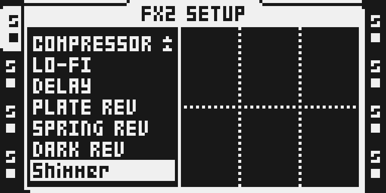
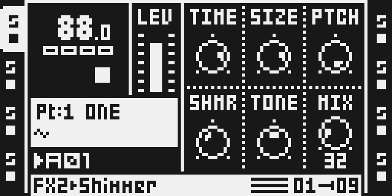
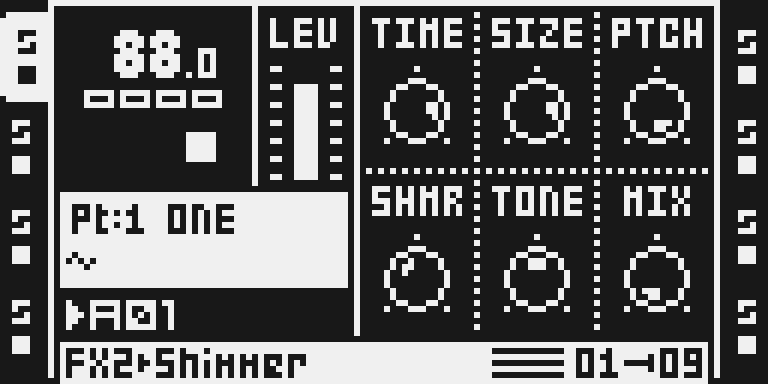

# Shimmer

Version: 0.1.0-experimental · author: [Julius Sylvest](https://github.com/juliussylvest-lab)

## Overview

Shimmer is a stereo FX2 insert for Octatrack MKI and MKII on OS 1.40C. Its
sound-design target is a diffuse, spacious reverb whose feedback can be shifted
up or down an octave. Octave-up feedback builds a bright floating cloud;
octave-down feedback adds a lower halo. SHMR at zero gives ordinary reverb.

Each instance owns its reverb and pitch state. A shared send bus is unnecessary:
the effect processes the selected track in place, is compiled for both DSP
cores, and claims its existing 16,384-word FX2 allocator slot. The 3,072-word
FX1 slot is too small for this design. The target is an original shimmer
reverb, inspired by the sound of ValhallaShimmer, with no proprietary plugin
source, stock firmware data or extracted tables included.

This is a development version. Native DSP renders, six-control click tests and
guarded stress runs have passed. The pitched sound audit retains four failures
in its static harmonic-fold mask; the evidence and remaining review are in
[TESTING.md](TESTING.md).
Physical hardware operation has not been tested or reported.

## Controls

All six musical controls are on FX2 **MAIN**. The SETUP page selects the effect
and has no additional controls. Each main parameter has 128 stored values and
is designed to accept the stock parameter-lock, LFO and scene paths. The DSP
smooths continuous values; changing delay size and pitch also requires
interpolated reads and continuous crossfade phases.

| Encoder | Label | Default | Range and behaviour |
| --- | --- | ---: | --- |
| A | TIME | 96 | 0 short → 127 long; bounded feedback sets tail length. |
| B | SIZE | 96 | 0 compact → 127 spacious; fractional delay spread changes smoothly. |
| C | PTCH | 127 | 0 = −12 semitones, 64 = 0, 127 = +12 semitones; continuous between these points. |
| D | SHMR | 48 | 0 ordinary reverb → 127 maximum pitch-shifted share of feedback. |
| E | TONE | 64 | 0 dark → 127 bright; feedback and wet-path bandwidth, with a separate antialias limit. |
| F | MIX | 0 | 0 exact dry after the smoothing ramp settles; 127 wet only. |

TIME and SHMR are separate controls: TIME bounds the overall return gain,
while SHMR blends its normal and shifted components. Maximum SHMR is not a
freeze or an unbounded regeneration mode. MIX changes output balance, not
stored project data. The default MIX of zero starts the effect dry.

PTCH uses a plain 0–127 dial so its stored count stays compatible with the
normal modulation paths. The three musical landmarks are printed above;
the LCD does not claim to display semitone units. A slow SIZE movement may
create a deliberate pitch glide through the reverb delays; zipper noise and
discontinuous tap changes are defects. Finite pitch grains add sidebands to
sustained notes: this is a cloud effect, and does not promise an exactly tuned
dominant spectral peak. The tested workload supports **two Shimmers among
tracks 1–4 and two among tracks 5–8**, four total. MIX 0 keeps the tank running
and still consumes that DSP budget.

## Usage

Use a private modified build that contains this exact module version. Shimmer
is a new effect chooser entry, not an option present in the original OS.

1. Leave MIDI editing if active, then select the audio track with its TRACK key.
2. On MKII, hold **FUNC** and press **FX2**. On MKI, hold **FUNCTION** and press
   **EFFECT 2**. This opens the existing FX2 SETUP chooser.
3. Select **Shimmer** with the arrow keys and press **YES** (MKII) or
   **ENTER/YES** (MKI).
4. Close with **NO** (MKII) or **EXIT/NO** (MKI), then press **FX2** or
   **EFFECT 2** once to show the main page.

### Quick tutorial

1. **Select and start gently.** Select Shimmer in FX2 as above, play a short
   sample at a conservative level, and set TIME 96, SIZE 96, PTCH 127,
   SHMR 48, TONE 64 and MIX 32.
2. **Build the cloud.** Raise SHMR while a sustained note or chord plays.
   The intended result is a growing upper-octave halo. Compare SHMR 0,
   then PTCH 64 and PTCH 0 to hear ordinary, unshifted and lower-octave returns.
3. **Place and bypass it.** Lower TONE for a darker tail and adjust TIME to
   fit the phrase. Set MIX 127 to hear the wet path alone, then MIX 0 to
   return to dry. Watch the level while comparing; do not assume loudness
   differences prove better sound.
4. **Animate it.** Lock alternating SHMR values on adjacent trigs, then try
   a slow LFO on TONE and scenes with different MIX values. Confirm each
   control returns to its base value on an unlocked step. Hardware behaviour
   remains untested until the results are recorded.

## Compatibility and limitations

Target: Octatrack MKI and MKII, original base OS **1.40C**, audio-track FX2.
The module uses new effect ID **0x1e**, leaves stock effect identities intact,
and uses the existing FX2 selection and main-page gestures. It has no bus,
ColdFire event callback, custom sequencer clock, freeze mode or setup controls.
The pitch read phase follows the audio sample clock: it is interpolation state,
not an independent musical transport. Reverb tails are runtime audio state,
not project data. Saving a project is expected to save the effect assignment
and six parameter bytes, not a live tail.

No stock-flow changes are proposed. TESTING.md lists the neighbouring flows
that must be compared with and without the module. A flow listed there is
not verified merely because it is listed. Future parameter-slot changes need
explicit migration of Part defaults, locks, scenes and LFO destinations.

The full-stock native image preserves all stock chooser entries. Selecting a
loaded wet instance initially returns dry audio while its ring is cleared
(2,048 samples, 46.44 ms), then fades towards the loaded MIX value. This is
startup preparation, not a fixed audio latency or a saved reverb tail.

Use the explicit dynamic-loader development profile for this stock-preserving
build. The public configurator currently uses the older static profile, which
would reclaim PLATE REV and SPRING REV for Shimmer. That profile is comparison
evidence only and is **not the proposed unit build**. This submission does not
enable the loader globally or authorize removing either stock effect. Public
release needs a reviewed stock-preserving integration as well as qualification.

The tested four-instance workload uses 924 modeled DSP cycles/sample per
instance; a matched software benchmark costs 4.174 times DARK REV's executed
instructions. Other effects share the remaining budget. Three or four Shimmers
on one core are outside the tested supported workload. Native project save and
fresh-process load restore the six controls; Part reload after unsaved edits,
physical MKI/MKII behaviour and reboot survival remain qualification gaps. The first release also
needs the Modwerk owner's approval, including review of this cost and the
pitched audit's limitations.

## Tests and measurements

See [TESTING.md](TESTING.md) for exact commands, source/build identities,
software measurements and the physical-unit test procedure. The existing
`fx:audit` examines aliasing, clipping, DC and extended idle decay. Its optional
`--warmup` allows a long reverb to settle without changing its analysis limits.
The existing
`perf:audit` checks static and measured worst-case DSP cost, a **DARK REV**
stock comparison and a guarded stress run. A green metadata check alone does
not prove sound quality, timing, modulation or hardware safety.

The native gate [verify.py](verify.py) must measure the module it names and
refuse a fallback dispatch entry. Tests must exercise both signs of audio,
parameter endpoints, continuously changing controls, dirty initial state and
multiple independent instances. Observed results include failed audits;
no firmware, stock code, raw tables, dumps, project/card images or built images
belong in this module folder.

## Authorship and licences

Original Shimmer work: Julius Sylvest (`juliussylvest-lab`). The allocator-owned
insert and FDN design retain credit to Jannik Aßfalg's Mini Verb and Sam Banks'
octabam SDK. The original mathematical pitch table is generated from an
exponential expression rather than copied from firmware. Maxolydian's octamax
tooling retains its own notice in [LICENSE](LICENSE) and the SDK attribution.

Source and documentation use the MIT licence with retained notices.
ValhallaShimmer is a reference for the intended sound. Valhalla and Elektron
retain their respective product and firmware rights.

## Screens and audio

These are actual monochrome emulator LCD captures. MKII uses the native
dynamic/all-stock image; the alternate MKI captures use the explicit browser
dynamic/all-stock image. Their identities, original pixels and exact panel
plans are in [capture.json](media/capture.json) and
[capture-browser-mki.json](media/capture-browser-mki.json). They establish UI
appearance and access in those software builds; physical hardware is untested.

Hold FUNC and press FX2, select Shimmer and press YES. On MKI use FUNCTION,
EFFECT 2 and ENTER/YES. Shimmer appears after DARK REV.

Press FX2 once for MAIN and turn encoder F to MIX 32. Try TIME 96, SIZE 96,
PTCH 127, SHMR 48 and TONE 64 for the tutorial's upper-octave cloud.

Turn F back to MIX 0 for dry audio after smoothing. The tank still runs and
uses its DSP budget. Alternate real MKI-panel captures:
[chooser](media/ot-location-mki.png), [MIX 32](media/ot-mix-mki.png),
[dry MAIN](media/ot-controls-mki.png).

No human listening verdict is recorded. Synthetic native-DSP audio previews
remain private and are not firmware or hardware evidence.
